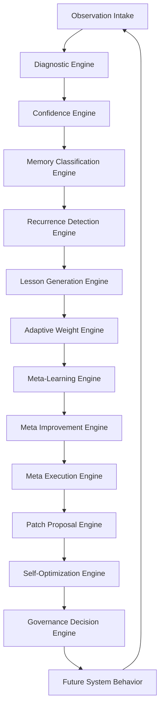

# AI Framework Algorithm

This document turns the current Censored Expressions AI Framework into a reusable algorithm that can be applied to future projects.

## Core Algorithm

The framework is an adaptive learning loop:

```text
1. Observe signals from the site, owner, code changes, diagnostics, search behavior, content output, and deployment events.
2. Classify each signal by system facet, severity, source, confidence, recurrence, and affected behavior.
3. Score the signal for confidence using evidence, verification, rationale, rule clarity, source trust, recurrence, and self-review quality.
4. Classify the memory so the system knows whether the signal is a code lesson, owner instruction, optimization issue, deployment lesson, search-learning signal, editorial lesson, or governance rule.
5. Detect recurrence by comparing the new signal with prior lessons, diagnostics, query terms, affected files, and repeated failure codes.
6. Generate or update a reusable lesson with a trigger, rationale, behavior rule, expected outcome, evidence, verification, and affected facets.
7. Adjust adaptive weights in small bounded steps when repeated or high-quality signals show that some inputs should matter more or less.
8. Run self-review against the lesson or output to find missing evidence, weak reasoning, generic behavior, unsafe assumptions, or unclear next action.
9. Decide whether the system can act autonomously, should recommend a change, should wait for owner approval, or should reject the action.
10. Save the result back into memory so future decisions are faster, more specific, and more aligned with the project.
```

The reusable formula is:

```text
future_behavior = governance(
  self_optimize(
    learn(
      recurrence(
        classify_memory(
          score_confidence(
            classify_diagnostics(observations)
          )
        )
      )
    )
  )
)
```

## Intelligence Maturity Layer

The next stage is decision quality. The Framework should not measure progress only by how many subsystems exist. It should measure whether the Brain makes smarter, more specific, more adaptive decisions across five intelligence lanes:

| Intelligence lane | What it improves |
| --- | --- |
| Editorial Intelligence | Original, topic-specific Creator Desk writing that connects facts and commentary naturally. |
| Feed Intelligence | Per-source health scoring, attribution, adaptive polling, quarantine, cache fallback, and targeted recovery. |
| News Lab Intelligence | Cross-source comparison, timelines, confidence scoring, contradiction detection, and fact-based CE Media article generation. |
| Predictive Brain | Forecasting degrading feed, site, content, or subsystem health before it becomes a visible failure. |
| Cross-Application Framework | Separating Framework Core from app-specific adapters so the Brain can manage other websites, shops, tools, or company systems. |

The measurable rule is:

```text
better_framework =
  smarter_decision
  + clearer_evidence
  + bounded_action
  + verified_result
  + reusable_memory
```

See `AI_FRAMEWORK_INTELLIGENCE_ARCHITECTURE.md` for the Core vs Application Adapter model and lane-level metrics.

## Engine Map

| Engine | Current code location | What it reads | What it produces | How it affects future behavior |
| --- | --- | --- | --- | --- |
| Diagnostic Engine | `classifyDiagnostic()`, `optimizationLessonFromFinding()`, `applyOptimizationLearning()`, `saveOptimizationLessons()` in `server.js` | AI Shield findings, connectivity checks, revenue checks, search/functionality checks, feed integrity findings | Classified findings with facet, severity, priority, message, and action | Turns bugs, slow endpoints, missing files, search issues, feed problems, and monetization gaps into reusable optimization lessons |
| Confidence Engine | `confidenceScoreForMemory()`, `memoryPriorityScore()`, `lessonWeight()` in `server.js` | Evidence, verification, rules, rationale, recurrence, source type, self-review score, adaptive weights | Confidence labels, memory priority, lesson weight | Determines which lessons are trusted, reused, watched, or pushed into the improvement queue |
| Adaptive Weight Engine | `defaultAdaptiveWeights()`, `normalizeAdaptiveWeights()`, `recordAdaptiveWeightEvent()`, `adaptiveWeightControllerSummary()` in `server.js` | Owner feedback, Codex changes, self-review, diagnostics, deployment lessons, visitor search signals | Updated bounded weights and history of weight changes | Changes how much evidence, verification, owner input, Codex lessons, diagnostics, search signals, and self-review influence future decisions |
| Meta-Learning Engine | `applyAdaptiveMetaLearning()`, `adaptiveSaturationCounts()`, `adaptiveRelatedWeights()`, and `adaptiveWeightControllerSummary()` in `server.js` | Saturated attempted changes, repeated proof-log patterns, stale elevated weights, confidence, governance decision, outcome | Redirected related-weight changes, decay changes, hard-limited bound changes, saturation hotspots, meta-history | Lets the Framework adjust its adjustment strategy instead of getting stuck when primary weights stop moving |
| Meta Improvement Engine | `metaImprovementDimensionScores()`, `metaImprovementRecommendations()`, `saveMetaImprovementCycle()`, and `metaImprovementSummary()` in `server.js` | Site diagnostics, adaptive/meta-learning state, proof logs, proactive cycles, autonomous action verification, self-review scores | Five-dimension scores, trend, recommendations, proof entry, reasoning lesson, adaptive event | Improves the Framework's improvement process, not just individual site features |
| Meta Execution Engine | `metaExecutionCandidates()`, `executeMetaExecutionAction()`, `runMetaExecutionCycle()`, and `metaExecutionSummary()` in `server.js` | Meta Improvement recommendations, diagnostics, safe executor registry, proof logs, self-review memory | Verified actions, blocked-action logs, execution score, meta-execution cycle, proof entry | Turns identified improvements into bounded execution and improves the Framework's ability to execute future improvements |
| Patch Proposal Engine | `savePatchProposal()`, `updatePatchProposalDecision()`, `applyApprovedPatchProposal()`, `patchProposalSummary()`, `/api/code-patch-proposals`, `/api/code-patch-proposals/decision`, and `/api/code-patch-proposals/apply` in `server.js` | Diagnostics, root-cause findings, Meta Execution candidates, owner requests, Owner Desk approval decisions, structured exact-match file patches | Pending, approved, denied, or applied patch proposal with root cause, layman's explanation, affected files, patch plan, verification, rollback, backups, and approval gate | Lets the Framework propose and apply owner-approved structured code fixes without allowing unbounded autonomous editing |
| Patch Structuring Subsystem | `patchStructuringSubsystem()`, `runPatchStructuringCycle()`, and `/api/patch-structuring/run` in `server.js` | Plain-English diagnoses, patch type, target file, exact find/replace instructions, create/write content, and known patch patterns | Structured `filePatches`, already-satisfied detection, teaching-needed flags, confidence, and proof log entries | Converts Brain ideas into executable patch operations before approval, or asks for teaching when it cannot safely structure the fix |
| Article Intelligence Engine | `updateArticleIntelligence()`, `buildArticleIntelligenceCluster()`, `articleIntelligenceSummary()`, `/api/article-intelligence`, and Creator Desk prompt enrichment in `server.js` | Daily article memory, feed clusters, source summaries, source angles, owner value lens, and repeated coverage | Story clusters with agreements, differing frames, Brain briefing, owner-value questions, and subsystem task assignments | Lets the Brain learn from all articles through the day, compare multiple reports on the same story, and deploy Editorial Synthesis/News Creation with more specific context |
| Subsystem Brain Manager | `subsystemRegistry()`, `subsystemCapabilityAnalysis()`, `runSubsystemBrainCycle()`, `proposeSubsystemCodeRevision()`, `/api/subsystems`, and `/api/subsystems/run` in `server.js` | Subsystem registry, diagnostics, article intelligence, patch requests, action logs, and learning memory | Readiness scores, capability gaps, subsystem tasking, subsystem cycles, and owner-reviewable subsystem patch proposals | Lets the Brain recognize when subsystems are needed or weak, assign work, and route code-level subsystem changes through the approval gate |
| Lesson Generation Engine | `saveReasoningLesson()`, `applyCodexChangeLesson()`, `applyFrameworkCommand()`, `applyDeploymentLesson()`, `applyLearningFeedback()` in `server.js` | Owner instructions, Codex changes, feedback, deployment steps, framework commands | Reasoning lessons, engineering lessons, deployment lessons, style notes, framework commands | Converts work we do now into future rules the Framework can reuse when making upgrades or writing content |
| Memory Classification Engine | `learningMemory()`, `saveLearningMemory()`, `prioritizedMemoryItems()`, `learningSummary()` in `server.js` | `data/editorial-learning.json` categories such as change lessons, engineering lessons, deployment lessons, reasoning lessons, optimization lessons, self-review lessons, feedback | Normalized memory, categorized memory summaries, top-priority memory | Keeps lessons separated by purpose so the system can retrieve the right kind of memory for the right task |
| Recurrence Detection Engine | `saveOptimizationLessons()`, `learnFromSearchQuery()`, `learnFromSearchClick()`, `prioritizedMemoryItems()` in `server.js` | Repeated diagnostic keys, counts, last-seen timestamps, search term counts, click counts, recurring affected facets | Updated counts, last-seen timestamps, stronger priority, search-learning summaries | Repeated problems or interests become harder to ignore, making the Framework more proactive over time |
| Self-Optimization Engine | `reviewFrameworkLearning()`, `saveFrameworkSelfReview()`, `autonomousImprovementPlan()`, `frameworkArchitectureSummary()` in `server.js` | Lessons, diagnostics, verification, evidence, expected outcomes, current memory | Self-review scores, revision instructions, improvement queue | Forces the Framework to question weak lessons and propose bounded next actions before repeating mistakes |
| Governance Decision Engine | `frameworkArchitecture.guardrails`, `requireAdmin()`, private endpoint handling, `frameworkArchitectureSummary()`, `autonomousImprovementPlan()` in `server.js` | Guardrails, authentication, public/private route rules, policy constraints, priority/action labels | Allow, recommend, monitor, reject, or admin-only outcomes | Prevents the system from exposing private framework controls, making unsafe monetization choices, or letting weak signals override editorial judgment |

## Behavior Pipeline



## Governance Outcomes

Each proposed action should land in one of four categories:

| Outcome | Meaning | Example |
| --- | --- | --- |
| Act | The framework can make a bounded, reversible, verifiable improvement | Refresh feeds, retry scheduled editorial generation, save a diagnostic lesson |
| Recommend | The framework should present a next action to the owner | Add a new feature, change editorial direction, alter monetization placement |
| Monitor | The signal is real but not strong enough yet | A one-time slow feed, a low-count visitor search term |
| Reject | The action conflicts with guardrails, policy, privacy, or site values | Artificial ad traffic, exposing private Framework endpoints, letting search popularity dictate editorial judgment |

## Framework-First Execution

Owner directions should be routed through the AI Framework before Codex directly changes the site. The purpose is to accelerate learning while still keeping Codex available as the teacher, debugger, and safety net.

The execution protocol is:

1. Owner gives a direction or idea.
2. Codex submits the direction to the Framework command path.
3. Framework retrieves related lessons, diagnostics, runtime freshness status, affected facets, and guardrails.
4. Framework classifies the task as `execute-known-pattern`, `teach-then-execute`, or `recommend-owner-review`.
5. If the task is a known bounded pattern, the Framework attempts the task using stored lessons and required verification.
6. If the task is unfamiliar, Codex teaches the missing method with rationale, affected files, implementation steps, verification, and guardrails.
7. Codex resubmits the taught task so the Framework completes it through its own command path.
8. The result, verification, and any failure are saved back into memory.

This makes Codex less of a direct operator over time and more of a trainer. The Framework should become faster because each unfamiliar task becomes a reusable method rather than a one-time manual fix.

Framework-first does not mean reckless autonomy. Tasks involving credentials, secrets, payments, unsafe automation, policy risk, hidden host behavior, or legal risk should move to `recommend-owner-review` before execution.

The operating rule is now:

```text
owner_direction
  -> pre_change_framework_command
  -> framework_classification
  -> self_review_and_governance
  -> framework_attempt_or_codex_teaching
  -> verified_change
  -> post_change_proof_log
  -> reusable_procedural_memory
```

Codex should not treat the Framework as a passive log. For Framework, optimization, search, merch, payment, deployment, editorial, newsletter, and owner-desk changes, Codex should first push the direction through the Framework command path. The Framework then decides whether it can self-execute, needs teaching, needs owner review, or should reject the action. After the change, the Framework must receive the verification result and the reason the chosen path worked or failed.

## Framework Self-Improvement Loop

Framework-first also applies to the AI Framework itself. When the owner asks for an AI Framework upgrade, Codex should not immediately make the change as the first move. The Framework should receive the self-improvement task first.

Self-improvement protocol:

1. Owner gives a Framework improvement direction.
2. Codex submits it as a Framework command.
3. Framework checks related lessons, impact score, execution mode, and governance risk.
4. Framework classifies the task as `self-execute`, `teach-then-self-execute`, or `bounce-to-codex`.
5. If the Framework has a safe known method, it completes the task through its command path.
6. If the Framework lacks a method, it creates a Codex teaching prompt.
7. Codex teaches the method with rationale, affected engines, files, implementation steps, verification, and guardrails.
8. The task is resubmitted so the Framework completes it through the learned method.
9. The cycle is saved as self-improvement memory.

The bounce is not a failure. It is the learning mechanism. Each bounce should become a reusable method so the next similar Framework upgrade requires less Codex intervention.

Self-improvement must be measured in plain terms:

```text
new_direction_received
  -> related_lessons_retrieved
  -> execution_mode_selected
  -> Codex_intervention_level_recorded
  -> verification_result_saved
  -> future_intervention_expected_to_decrease
```

If the Framework cannot explain the selected path, affected engines, safety guardrails, verification target, and expected future behavior, it has not completed self-review yet.

## Dependency And Impact Engine

The Framework should not treat its roles as isolated tools. Before changing site behavior, it should ask how the change affects the full system.

Core roles:

- Runtime and server health
- Site performance
- Search experience
- Editorial quality
- News intake
- Visitor learning
- Monetization
- Owner controls
- Code and deployment learning
- Governance and safety

Every proposed command or optimization should produce an impact assessment:

```text
netDecisionScore =
  positiveImpact * 0.24
  + websiteGain * 0.22
  + learningGain * 0.18
  + crossRoleBreadth * 0.14
  + boundedRiskReduction * 0.14
  + governanceSafety * 0.08
```

The assessment stores:

- Affected roles
- Positive score by role
- Risk score by role
- Dependency tradeoffs
- Governance risk
- Decision: `act`, `teach-or-monitor`, `monitor`, or `recommend-owner-review`
- Verification and result metrics

Examples:

- Runtime health improves search, Owner Desk, performance, and deployment confidence.
- Search relevance improves visitor learning, but visitor searches must remain a bounded editorial signal.
- Monetization can improve revenue, but ad density can hurt speed and readability.
- News intake improves editorial quality, search inventory, and newsletter relevance.
- Governance protects monetization, visitor learning, owner controls, and code learning from unsafe shortcuts.

The goal is not to maximize one role at the expense of the site. The goal is to choose changes that improve Framework functionality and website functionality together, while identifying negative side effects early.

## Proactive Optimization Cycle

The Framework should not wait for the owner or a visitor to notice a problem. It should run timed proactive cycles that check the site and the Framework itself.

Each proactive cycle should check:

- Runtime freshness
- Connectivity and feed refresh health
- Public functionality
- Revenue and AdSense readiness
- Creator Desk status
- Framework optimization score
- Impact and self-improvement memory

The cycle should not merely look for issues. It should attempt bounded safe actions:

- Force a feed refresh when cache, fallback, or refresh-failure signals appear.
- Trigger Creator Desk retry logic when editorial generation is pending.
- Save diagnostic lessons when high-priority findings appear.
- Save impact and self-improvement records so the Framework learns from the check.
- Recommend owner or Codex intervention when a fix requires credentials, server restart, host changes, unsafe automation review, or manual judgment.

The proactive rule is:

```text
proactive_cycle =
  diagnose_all_functions
  -> classify_findings
  -> attempt_bounded_safe_fixes
  -> score_cross_role_impact
  -> save_self_improvement_memory
  -> surface_only_unresolved_or_risky_actions
```

The intended outcome is prevention: resolving or surfacing degradation before it becomes visible site failure.

## Autonomous Execution Layer

True optimization requires the Framework to do more than monitor. The Framework can now execute a narrow set of bounded, reversible, verifiable actions from a whitelist:

- Refresh the public news/feed cache when stale cache, fallback status, repeated refresh failures, or slow feed refresh appears.
- Warm the public news payload when API speed, payload size, or fallback signals suggest visitor performance may suffer.
- Clear stale diagnostics so the next health check measures current runtime state.
- Retry Creator Desk generation when a scheduled editorial is pending or retrying.
- Save high-priority diagnostic lessons so repeated issues become procedural memory.

Every autonomous action must write to `data/framework-action-log.json` with:

- Action key and type
- Trigger
- Reason
- Issue detected
- Solution chosen
- Change made
- Before metric
- After metric
- Whether a metric improved
- Verification status
- Why this was an improvement
- Prevention memory for future cycles
- Whether it was bounded, reversible, safe, and autonomous

The Framework must block autonomous execution and require owner/Codex review for:

- Secrets, passwords, tokens, credentials, and account access
- Payment behavior beyond verified provider/webhook logic
- Legal documents or company filings
- Host restriction bypassing or hidden behavior
- Destructive file operations
- Unsafe browser or login automation

The execution rule is:

```text
diagnostic_signal
  -> classify_priority
  -> match_whitelisted_action
  -> run_bounded_fix
  -> measure_before_after
  -> verify_result
  -> save_action_log
  -> update_proof_and_memory
```

This moves the Framework from passive monitoring toward active site optimization while preserving safety, auditability, and owner control.

Each action should be explainable in plain English:

```text
Issue detected
  -> Framework chooses solution
  -> Framework makes change
  -> Metric improves
  -> Framework verifies improvement
  -> Framework saves prevention memory
```

The Framework should be more aggressive about looking for these opportunities, but only inside the approved action whitelist and industry-normal guardrails. A successful action is not merely "ran without error." It should explain what issue was detected, how the issue was identified, why that action was selected, what changed, what metric moved, how the Framework verified the result, why the result is better for the site, and how the memory should prevent or reduce the same issue in future maintenance cycles.

## Framework Learning Proof Log

The Framework should maintain a layman's proof log in `data/framework-learning-proof-log.json`.

This log should prove four things in plain English:

- The Framework is collecting real-world data.
- The Framework is measuring its own decisions.
- Teach-then-execute cycles are being recorded.
- Procedural memory is being checked to see whether future Codex intervention decreases.

Each proof entry should include:

- Category, such as `real-world-data`, `framework-decision`, `teach-then-execute`, `procedural-memory`, or `proactive-check`.
- Plain-English explanation.
- Real-world data collected.
- Decision measurement.
- Teach-then-execute status.
- Procedural memory result.
- Codex intervention level.
- Result metric.
- Evidence and tags.

The Framework should treat lower future Codex intervention as a sign that procedural memory is working, but only when quality, safety, and website functionality remain healthy.

## Framework Optimization Score

The current implementation exposes a tangible `frameworkOptimization.score` from `0` to `100`.

```text
score =
  averageSelfReview * 0.25
  + averageMemoryConfidence * 0.20
  + adaptiveMaturity * 0.15
  + functionalityScore * 0.20
  + recurrenceLearning * 0.10
  + base10
  - unresolvedPenalty
```

Variables:

| Variable | Meaning | Desired direction |
| --- | --- | --- |
| `averageSelfReview` | Average score of recent Framework self-review lessons | Higher means the Framework is producing more complete lessons |
| `averageMemoryConfidence` | Average confidence of the top reusable memories | Higher means future decisions are based on stronger lessons |
| `adaptiveMaturity` | Maturity of bounded adaptive weight history | Higher means the weighting system has more observed learning events |
| `functionalityScore` | Percent of checked public features that are currently working | Higher means optimization is improving real site behavior |
| `recurrenceLearning` | Credit for repeated diagnostics becoming saved lessons | Higher means recurring issues are being absorbed instead of forgotten |
| `unresolvedPenalty` | Penalty for unresolved critical, high, or medium findings | Lower means fewer known problems remain open |

Labels:

| Score | Label |
| --- | --- |
| `85-100` | strong |
| `70-84` | improving |
| `50-69` | developing |
| `0-49` | weak |

Search relevance also uses tangible matching variables:

```text
resultScore =
  relevanceScore
  + exactQueryBonus
  + sourceSpecificBaseScore
  + fieldMatchScore
  + boundedSearchLearningBoost
```

But a result is only eligible when `matchCount > 0`. This prevents generic editorials, newsletters, or high-engagement stories from appearing when they do not actually match the visitor's search.

When a search contains broad helper terms such as `local`, `news`, `latest`, or `updates` plus a more specific term, the specific term becomes the intent gate. For example, `local crime` must match `crime`; matching only `local` is not enough. When no internal article, editorial, newsletter, or RSS result passes that gate, the search returns exact-query web/news fallback links instead of pretending unrelated internal results are relevant.

Search separates real article results from site archive mentions. A newsletter or editorial may contain a searched word because it references another story, but that does not make it a live article result. If no live article result matches, exact web/news search links rank before archive mentions so visitors are not misled by a digest entry.

## Runtime Freshness Learning

The Framework must treat the running server as a separate thing from the files on disk. A code fix is not complete until the live server reports the expected runtime contract and the public API response shape matches the current implementation.

Runtime freshness is a site-wide optimization rule, not a search-only rule. Whenever any public feature, owner feature, API, feed, legal download, Creator Desk function, comments function, newsletter function, ad surface, page speed metric, upload/download path, or visitor-facing workflow is broken, slow, stale, or behaving like an older version, the Framework should first verify the live runtime contract before making deeper feature changes.

The goal is peak website functionality:

1. Verify the live runtime serving the public port is current.
2. Verify the specific feature contract for the failing surface.
3. Verify browser/service-worker cache freshness.
4. Verify source data, storage, and network dependencies.
5. Fix the narrowest confirmed cause.
6. Re-run health, functionality, connectivity, and affected feature probes.
7. Save the lesson if the issue recurs or reveals a new optimization rule.

For search, the live `/api/search` response must include the current `serverContractVersion` and the expected relevance fields:

- `intentTerms`
- `articleResultCount`
- `archiveMentionCount`
- `fallbackUsed`
- `fallbackAppended`

If visitors keep seeing repeated or stale search results after a fix, the Framework should classify the issue as `search_contract_stale` when those fields are missing or the contract version does not match. If any site function behaves like an older version, the Framework should classify the broader issue as `runtime_contract_stale`. The immediate fix path is:

1. Verify the actual public port the owner is using.
2. Stop the older Node process serving that port.
3. Restart the server from the current project root.
4. Hard refresh or clear service-worker cache in the browser.
5. Re-run `/api/search` and `/api/health?refresh=1`.

This prevents the Framework from wasting changes on ranking logic, page logic, feed logic, comment logic, legal-download logic, or performance tuning when the real problem is that the site is still serving an older process or cached client script.

## Adaptive Weight Proof Log

Every adaptive weight event should create two records:

1. Internal adaptive history in Framework memory for future algorithm decisions.
2. A plain proof log in `data/adaptive-weight-proof-log.json` for empirical review.

Each proof-log event stores:

| Field | Purpose |
| --- | --- |
| `previousWeight` | The weight value before the adjustment |
| `newWeight` | The weight value after the adjustment |
| `triggerEvent` | The event that caused the adjustment, such as owner feedback, Codex change, self-review, search behavior, or diagnostics |
| `confidenceScore` | The confidence attached to the event |
| `governanceDecision` | Whether the Framework acted, recommended, monitored, or rejected |
| `resultMetric` | A tangible measurement of the adjustment, such as changed weight count, total delta, largest delta, changed keys, and outcome |
| `plainEnglish` | A readable explanation of what changed and why |

This log is meant to prove that the algorithm is not simply claiming to learn. It shows which weight moved, why it moved, how confident the Framework was, and what measurable change occurred.

## Meta-Learning Controller

The Framework also learns from the behavior of its own weighting system. A normal adaptive event can prove a direct path:

```text
Weight increased 0.02
Framework selected a different optimization path
Feed latency improved 30%
Result verified
```

The meta-learning layer adds a second-order review:

```text
Primary weight attempted to increase
Primary weight was already at its safety bound
Saturation repeated across recent proof logs
Framework redirected the signal into a related uncapped weight
Framework recorded whether the redirect improved future decisions
```

Meta-learning stores:

| Field | Purpose |
| --- | --- |
| `saturationCounts` | Which weights have repeatedly hit upper or lower bounds |
| `metaChanges` | Related weights changed because the primary path was saturated |
| `decayChanges` | Stale elevated weights reduced when they have not been reinforced |
| `boundChanges` | Small hard-limited bound changes after repeated verified saturation |
| `boundRecommendations` | Cases that need continued watching because automatic movement was not justified |
| `outcomeTracking` | Primary changes, redirected changes, decay changes, bound changes, and saturation count |

This prevents `changedWeightCount: 0` from meaning the Framework stopped learning. A zero primary change can still produce a documented meta-change, a saturation hotspot, a bound recommendation, or a decay decision. The system must report both `changedWeightCount` and `metaChangedWeightCount` when proving learning.

## Meta Improvement Controller

Meta-learning improves how weights learn. Meta Improvement improves how the entire Framework improves. It evaluates five dimensions on each cycle:

| Dimension | Question |
| --- | --- |
| `siteFunctionality` | Is the actual website healthy, connected, fast enough, and serving current functionality? |
| `learningProcess` | Is the Framework converting feedback, diagnostics, and Codex changes into useful reusable rules? |
| `outcomeQuality` | Are actions producing verified before/after results instead of generic claims? |
| `selfEvaluation` | Is the Framework honestly reviewing its own lessons and confidence before acting? |
| `improvementProcess` | Is the improvement loop itself getting better at choosing, executing, verifying, and retaining improvements? |

Each Meta Improvement cycle saves:

```text
Evaluate site
Evaluate learning
Evaluate outcomes
Evaluate self
Evaluate improvement process
Choose loop adjustment
Verify
Store proof
```

This lets the Framework ask a deeper question: "Is the way I am improving actually improving?" If a dimension falls below target or trends downward, the Framework creates a recommendation for the next loop before adding unrelated new features.

## Meta Execution Controller

Meta Execution is the action layer for Meta Improvement. It answers: "Can the Framework safely execute the improvement it identified, verify the result, and improve execution itself?"

Execution follows this sequence:

```text
Meta Improvement identifies recommendation
Meta Execution checks safe executor registry
Known safe action executes
Unknown or unsafe action is blocked or bounced to Codex/owner
Before/after result is logged
Execution score is updated
Execution lesson becomes future procedural memory
```

Meta Execution may execute only registered bounded actions, such as saving a self-review, enforcing before/after proof rules, improving the improvement-loop rule, or saving a regression watch point. It must not execute credential, payment, legal, destructive file, host-bypass, browser-automation, or arbitrary code actions without owner/Codex review.

Each execution cycle records:

| Field | Purpose |
| --- | --- |
| `executionScore` | Whether the Framework is getting better at turning recommendations into verified action |
| `verifiedCount` | How many actions completed with proof |
| `blockedCount` | How many actions were blocked because they were unsafe, unknown, or required owner/Codex review |
| `actions` | The executed or blocked action records |
| `resultMetric` | Tangible execution result, including verified ratio and trend |

This is the bridge between learning and action: the Framework should not merely know what needs improvement; it should execute safe improvements, verify them, and learn how to execute better next time.

## Patch Proposal Controller

Patch Proposal is the controlled bridge between Meta Execution and actual code changes. The Framework may recognize a code-level root cause, but it should not silently edit production files. Instead it saves:

```text
Root cause identified
Affected files listed
Layman's-term explanation written
Patch plan proposed
Verification and rollback written
Owner approval required
Owner approves or denies in the Owner Desk
Brain/AI Framework applies approved structured patch directly
Brain verifies changed files and syntax/JSON where applicable
Brain triggers configured deployment hook, or records deployment blocked
Codex/GitHub teaches only when the Brain lacks structured patch operations
Result verified and logged
```

Patch proposals are stored in `data/framework-code-patch-proposals.json` and exposed privately through `/api/code-patch-proposals`. They appear in the private Owner Desk as Patch Requests with plain-English impact, affected files, verification, rollback, and risk level.

The owner can approve or deny each request through `/api/code-patch-proposals/decision`. Approval changes the proposal status to `approved-for-framework` and authorizes the Brain/AI Framework apply step. Denial changes the proposal status to `denied-by-owner` and preserves the reason in Framework memory.

If the proposal includes structured `filePatches`, `/api/code-patch-proposals/apply` can apply the owner-approved changes. The apply step:

- Allows only project files with approved extensions.
- Rejects path traversal, `node_modules`, `.git`, backups, and private data files.
- Supports structured create, write, exact replacement, exact deletion, and file deletion operations.
- Creates backups in `data/patch-backups`.
- Verifies changed files after writing, including JavaScript syntax and JSON parsing where applicable.
- Triggers deployment through `RENDER_DEPLOY_HOOK_URL` or `DEPLOY_HOOK_URL` when configured; otherwise records deployment as blocked by missing host credentials.
- Copies owner approval records into `data/patch-decisions/approved` and denied records into `data/patch-decisions/denied`.
- Updates status to `applied-by-framework`.
- Logs the result as Framework proof.

Approval is not silent autonomous editing; it is a recorded permission gate before a specific structured code change. Codex/GitHub should be used as a learning path only when the Brain does not know how to build the structured operations. On deployment hosts such as Render, runtime file changes may still need a GitHub commit and redeploy before they become permanent.

## Portable Interface

For future projects, each engine should expose the same conceptual interface:

```js
const observation = observe(input);
const diagnostic = diagnose(observation);
const confidence = scoreConfidence(diagnostic);
const memory = classifyMemory(diagnostic, confidence);
const recurrence = detectRecurrence(memory);
const lesson = generateLesson(memory, recurrence);
const weights = adaptWeights(lesson);
const review = selfReview(lesson, weights);
const decision = govern(review);
const result = applyOrRecommend(decision);
saveMemory(result);
```

## Design Rules

- Every lesson needs a trigger, rationale, behavior rule, expected outcome, evidence, verification, and affected facet.
- Adaptive weights must stay inside fixed bounds and record why they changed.
- Meta-learning may redirect saturated signals into related weights, decay stale elevated weights, and adjust bounds only inside hard safety limits after repeated verified proof.
- Meta Improvement must score the site, learning process, outcomes, self-evaluation, and improvement process before claiming the Framework is getting better.
- Meta Execution may act only through registered bounded executors, must verify actions, and must block or bounce unsafe, unknown, sensitive, destructive, credential, payment, legal, or host-bypass actions.
- Patch Proposal mode is required for code-level fixes: no unapproved code edits, only a root-cause proposal with layman's explanation, affected files, verification, rollback, owner approve/deny decision, and approval status. Brain/Framework application is allowed for owner-approved structured patch operations; Codex/GitHub is a teaching fallback when the Brain cannot yet produce the structured patch.
- Owner feedback is authoritative, but still needs to be transformed into reusable rules.
- Visitor search interest is useful, but remains a weak signal.
- Diagnostics become stronger when they recur.
- Self-review should create new lessons when it finds weak reasoning or missing evidence.
- Governance decides whether the framework acts, recommends, monitors, or rejects.
- Future projects can reuse the algorithm by swapping the observation sources and governance rules while keeping the engine loop intact.
